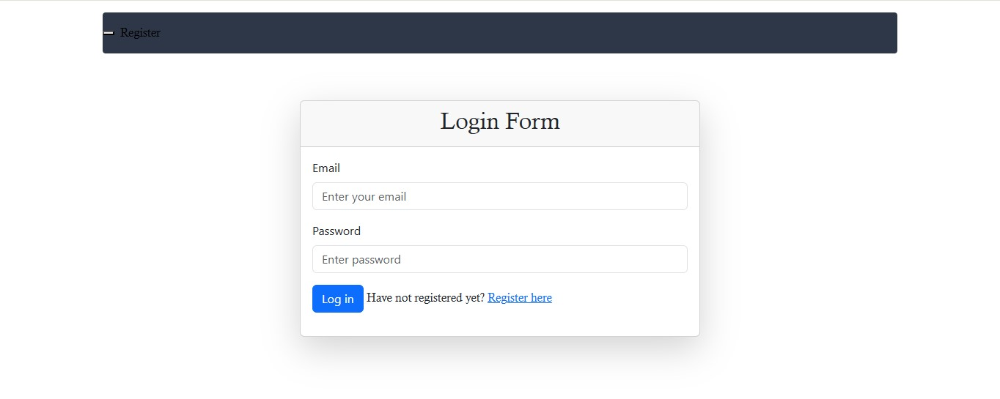
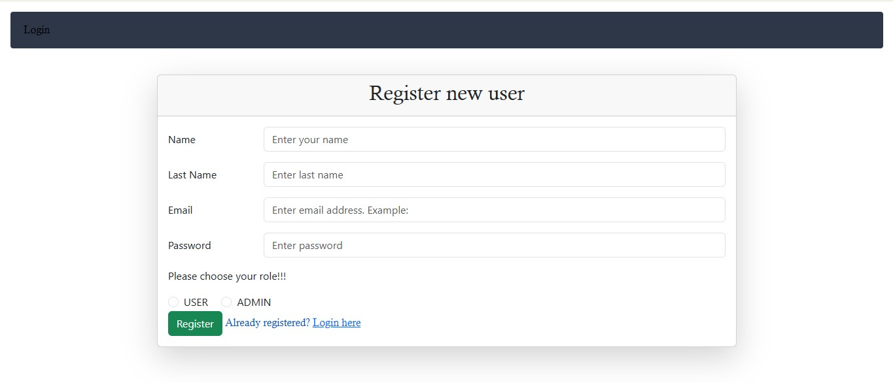
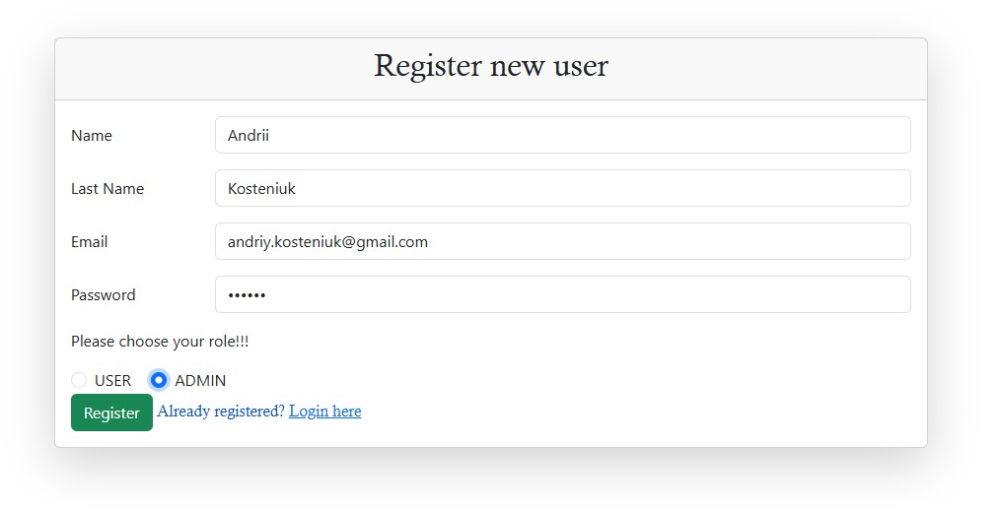
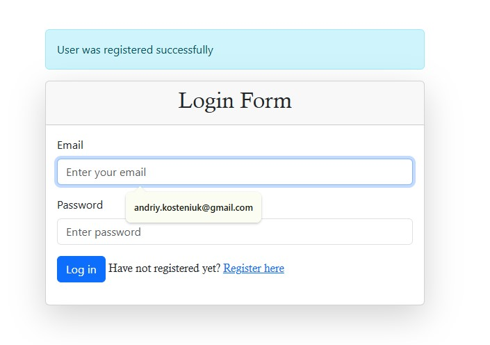
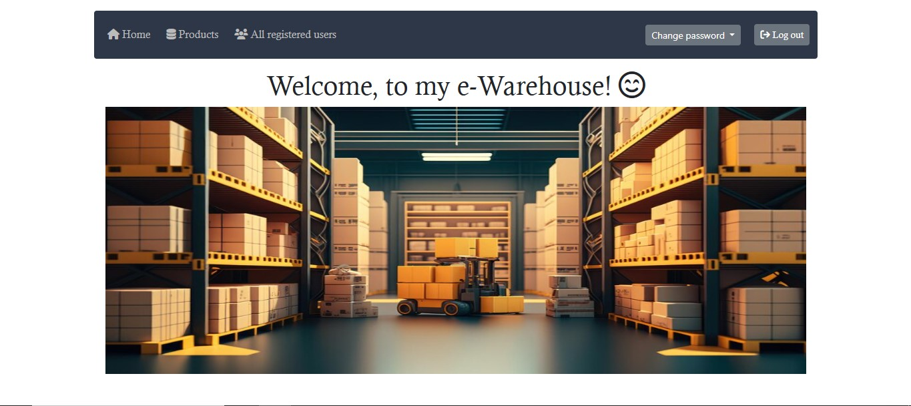
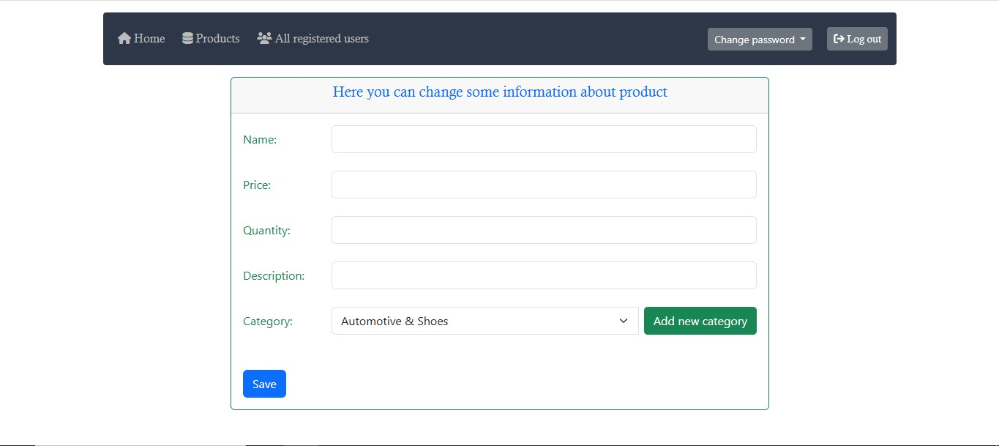
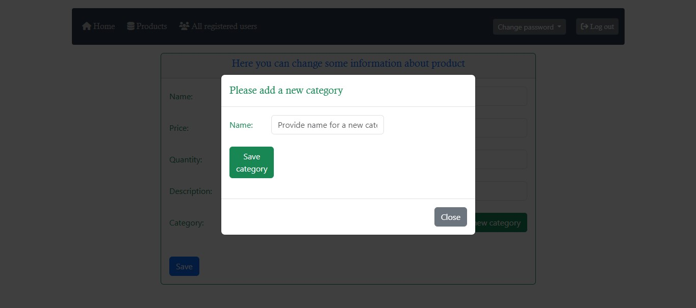
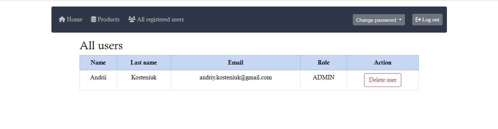
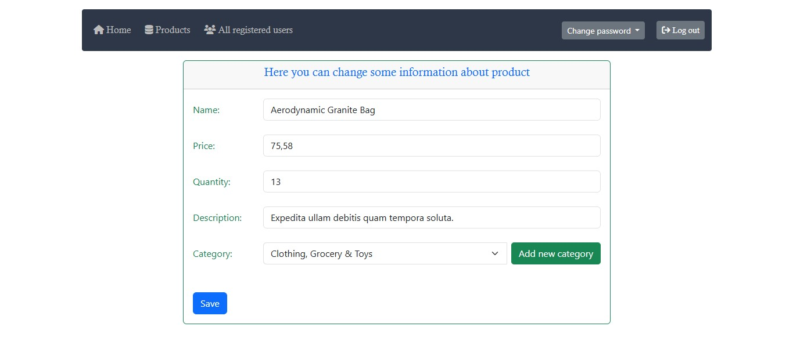
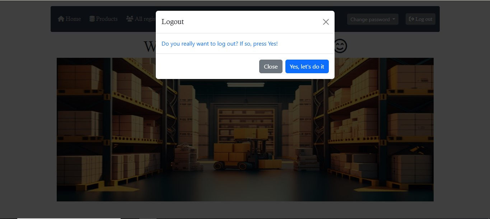

# Resource Management System

## 📌 Introduction

The _**Resource Management System**_ is a web application built using the _**Spring Framework**_ following the
_**MVC architecture**_.
It provides user authentication, role-based access control, product management,
and additional features like __pagination, sorting, caching, logging, and exception handling__.

The project includes an initializer that pre-populates the database with data, allowing users to test functionalities
immediately after setup.

### 📜 Table of Contents

* [Features](#-features)
* [Technologies Used](#-technologies-used)
* [Installation](#-installation)
* [Configuration](#configure-the-applicationproperties-already-set-up-in-the-project)
* [Usage](#-usage)
* [Security](#-security)
* [Database Initialization](#-database-initialization)
* [Logging & Exception Handling](#-logging--exception-handling)
* [Contributors](#-contributors)
* [Screenshots](#-images)

### ✨ Features

✅ User Authentication & Authorization (Spring Security, Login/Password)\
✅ Role-Based Access Control (Admin & User)\
✅ Product Management (Edit, Delete - Admin only, Create - User as well)\
✅ Pagination & Sorting\
✅ Caching Mechanism\
✅ Logging & Exception Handling\
✅ Export Products to Excel\
✅ Thymeleaf for UI\
✅ Bootstrap for Styling

### 🛠 Technologies Used

- Spring Framework (Spring Boot, Spring MVC, Spring Data JPA, Spring Security)
- Hibernate (JPA)
- Thymeleaf (Frontend)
- Bootstrap, HTML, CSS (UI)
- PostgreSQL (Database)
- Logging (SLF4J)
- Excel File Export (Apache POI)
- Exception Handling (ControllerAdvice)

### 🛠 Installation

Clone the Repository

```
   https://github.com/Andrii-Kosteniuk/Resource-Management-System.git
```

_**Set Up Environment Variables**_\
Before running the application, set the following environment variables:

- `${DB-name}` → Your PostgreSQL database name
- `${DB-username}` → Your PostgreSQL username
- `${DB-password}` → Your PostgreSQL password

### Configure the application.properties (already set up in the project)

``` properties
server.port=8081
server.error.include-exception=true
server.error.include-message=always

spring.datasource.driver-class-name=org.postgresql.Driver
spring.datasource.url=jdbc:postgresql://localhost:5432/${DB-name}
spring.datasource.username=${DB-username}
spring.datasource.password=${DB-password}
spring.jpa.open-in-view=true
spring.jpa.hibernate.ddl-auto=update
spring.jpa.properties.hibernate.dialect=org.hibernate.dialect.PostgreSQLDialect
spring.jpa.show-sql=true

spring.app.numberOfCategories=5
spring.app.numberOfProducts=10
spring.app.pageSize=10
```

Run the Application

``` sh
mvn spring-boot:run
```

The application will start on http://localhost:8081

### 🚀 Usage

_**User Roles & Permissions:**_

- USER Role
    - View products
    - Change their own password
    - Download a product list as an Excel file
    - Create a new product
- ADMIN Role
    - All USER permissions
    - Create/Edit/Delete Products

### 🔐 Security
- **Spring Security** is used for authentication & authorization
- Users must **log in** with a **username & password**
- Admin users have additional privileges
  
### 📂 Database Initialization
  A **DataInitializer** is included to ***pre-fill the database*** with sample data for testing.
  Upon startup, default categories and products will be inserted.

### 📜 Logging & Exception Handling
- SLF4J & Logback for logging
- ControllerAdvice for centralized exception handling

### 👥 Contributors
- Andrii Kosteniuk (https://github.com/Andrii-Kosteniuk)

### 📸 Images

1.User login page



2.User registration page



3.Registration a new user



4.User was registered successfully



5.Home page



6.Creating a new product



7.Creating a new category



8.Change password button


9.Change password form


10.All registered users



11.Editing existing product



12.Editing existing product
